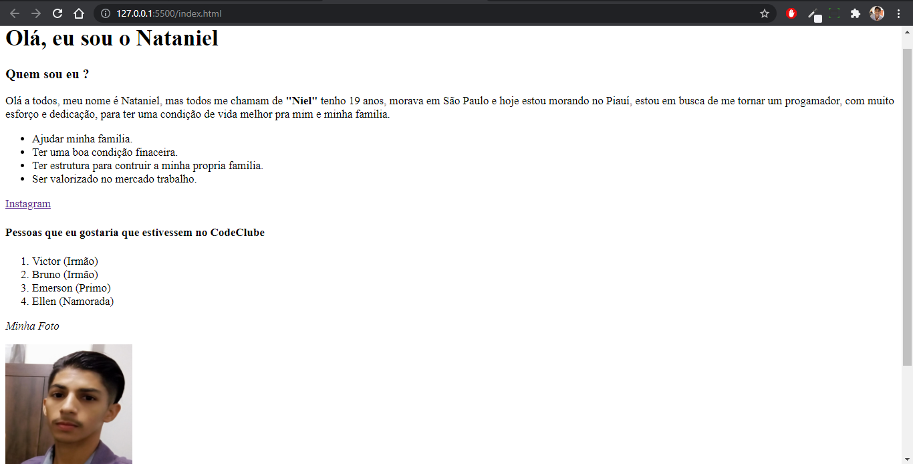

# Pequena apresentação

> Projeto feito apenas com HTML

### 🎯 Objetivo:

Esse foi meu primeiro projeto feito com o intuito de mostrar alguns comandos do HTML e colocá-los em prática.

<h3>🚀 Minhas Skills: </h3>

## 🤝 Desenvolvido por:

<table>
  <tr>
    <td align="center">
      <a href="https://www.linkedin.com/in/jos%C3%A9-nataniel-4764a4224/">
         
        
          <b>Nataniel Andrade</b>
        
      </a>
  </tr>
</table>
